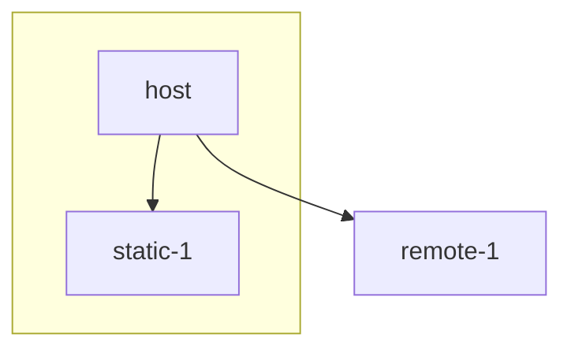

# wmfnext-shell

> **Warning**
>
> This repository will not be maintained as it's purpose is to inspire teams by showcasing how a federated SPA could be build on top of [Webpack Module Federation](https://webpack.js.org/concepts/module-federation) and [React Router](https://reactrouter.com/).

Webpack Module Federation is a great infrastructure piece to share code and dependencies between different independent codebases easier. But as is, it's pretty raw as it's a low level mecanism.

This shell aims to add a very thin and opinionated layer on top of Webpack Module Federation and React Router to complement the sharing mecanism with additional functionalities. Those functionalities will gentle the adoption of a federated application architecture and provide an opinionated direction on how to implement a federated SPA.

The idea behind this shell is to have an host application responsible of loading modules and providing shared functionalities like routing, messaging and logging. With this shell, a module is considered as an independent codebase matching a specific subdomain of the application. At bootstrap, the host application loads the modules and call a registration function for each of them with shared functionalities and an optional context. During the registration phase, each module dynamically *register it's routes and navigation links*. Then, pages and components of a module can use the provided hooks to access shared functionalities provided by the shell.

We recommend to aim for remote hosted modules loaded at runtime as it enables your teams to be fully autonomous by deploying their modules independently from the other parts of the application. Still, sometimes teams might want to gradually migrate toward a distributed architecture and would prefer to extract subdomains into independent modules in a monolithic but decoupled way before fully committing to remote modules. To accomodate those migration solutions, this shell support loading modules from a static registration function at build time. The functions could come from a package in a monorepos setup or could even come from a subdomain folder of a modular monolith. A dual bootstrapping setup is also supported, meaning an application could load a few remote hosted modules at runtime while also loading a few other modules at build time.

- [Features](#-features)
- [Examples](#-examples)
- [Installation](#-installation)
- [Basic usage](#-basic-usage)
- [Guides](#-guides)
    - [Setup an host application](#setup-an-host-application)
    - [Setup a remote application](#setup-a-remote-application)
    - [Register a module routes](#register-a-module-routes)
    - [Re-render the host application after the remote modules are ready](#re-render-the-host-application-after-the-remote-modules-are-ready)
    - [Setup a static module application](#setup-a-static-module-application)
    - [Register a module dynamic navigation items](#register-a-module-dynamic-navigation-items)
    - [Isolate module failures](#isolate-module-failures)
    - [Override the host layout for a module page](#override-the-host-layout-for-a-module-page)
    - [Share a user session](#share-a-user-session)
    - [Use the event bus](#use-the-event-bus)
    - [Share a custom service](#share-a-custom-service)
    - [Use a custom logger](#use-a-custom-logger)
    - [Fetch data](#fetch-data)
    - [Develop a module in isolation](#develop-a-module-in-isolation)
- [API](#-api)
- [Contributors guide](./CONTRIBUTING.md)

## 🙌 Features

The following features are supported by this shell:

- Loading of hosted remote modules at runtime
- Loading of static modules at build time
- Routing
- Navigation
- Shared user session
- Cross application messaging
- Logging
- Failures isolation
- Module development in isolation

## 🎉 Examples

For full examples of applications using this shell, have a look at:
- [wmfnext-host](https://github.com/patricklafrance/wmfnext-host) repository for an host application example + a static module example
- [wmfnext-remote-1](https://github.com/patricklafrance/wmfnext-remote-1) repository for a remote module example

## 🤘 Installation

To install the packages, [open a terminal in VSCode](https://code.visualstudio.com/docs/editor/integrated-terminal#_managing-multiple-terminals) and execute the following command at the root of the projects (host and modules) workspace:

```bash
yarn add wmfnext-shell
```

If you wish to include remote modules loaded at runtime using [Webpack Module Federation](https://webpack.js.org/concepts/module-federation) also execute the following command at the root of the projects (host and *remote* modules) workspace:

```bash
yarn add wmfnext-remote-loader
```

Once, installed, we recommend that you configure your projects to use [ESM](https://developer.mozilla.org/en-US/docs/Web/JavaScript/Guide/Modules) by default. To do so, open the `package.json` file and add the `type` property:

```json
{
    "type": "module"
}
```

## 📄 Basic usage

In this example, we'll focus solely on showcasing the happy path to create a federated SPA with this shell. 

To do so, we'll create a single remote module application (and of course an host application) and leave out static module application. To learn more about the other features and options of this shell, have a look at the [guides](#-guides) and the [API](#-api) section.

### Host application

👉 First, create a new application with the following files.

```
host-app
├── src
├──── App.tsx
├──── RootLayout.tsx
├──── HomePage.tsx
├──── bootstrap.tsx
├──── index.ts
├── webpack.config.js
```

> To learn more about the `bootstrap.tsx` file, read the following [article](https://dev.to/infoxicator/module-federation-shared-api-ach#using-an-async-boundary).

👉 Then, in the `boostrap.tsx` file, instanciate the shell `Runtime` and load the remote module.

```tsx
// host - boostrap.tsx

import { ConsoleLogger, RuntimeContext, Runtime } from "wmfnext-shell";
import type { RemoteDefinition } from "wmfnext-remote-loader";
import { App } from "./App";
import { createRoot } from "react-dom/client";
import { registerRemoteModules } from "wmfnext-remote-loader";

const Remotes: RemoteDefinition[] = [
    {
        url: "http://localhost:8081",
        name: "remote1"
    }
];

// Create the shell runtime.
const runtime = new Runtime({
    loggers: [new ConsoleLogger()]
});

// Register the remote module.
registerRemoteModules(Remotes, runtime);

const root = createRoot(document.getElementById("root"));

// Render the React app.
root.render(
    <RuntimeContext.Provider value={runtime}>
        <App />
    </RuntimeContext.Provider>
);
```

👉 Next, in the `App.tsx` file, retrieve the routes registered by the module and render the router.

```tsx
// host - App.tsx

import { RouterProvider, createBrowserRouter } from "react-router-dom";
import { lazy, useMemo } from "react";
import { useRoutes } from "wmfnext-shell";
import { RootLayout } from "./RootLayout";
import { useAreRemotesReady } from "wmfnext-remote-loader";

const HomePage = lazy(() => import("./HomePage"));

export function App() {
    // Re-render the application once the remote module is registered.
    const isReady = useAreRemotesReady();

    // Retrieve the routes registered by the module.
    const routes = useRoutes(runtime);

    // Create the router with an home page and the module routes.
    const router = useMemo(() => {
        return createBrowserRouter([
            {
                path: "/",
                element: <RootLayout />,
                children: [
                    {
                        index: true,
                        element: <HomePage />
                    },
                    ...routes
                ]
            }
        ]);
    }, [routes]);

    // Display a loading until the remote module is registered.
    if (!isReady) {
        return <Loading />;
    }

    // Render the router.
    return (
        <RouterProvider
            router={router}
            fallbackElement={<Loading />}
        />
    );
}
```

👉 And, create the `RootLayout` component to render the navigation items.

```tsx
// host - RootLayout.tsx

import { Link, Outlet } from "react-router-dom";
import { Suspense } from "react";
import { useNavigationItems } from "wmfnext-shell";

export function RootLayout() {
    // Retrieve the navigation items registered by the module.
    const navigationItems = useNavigationItems();

    return (
        <>
            <nav>
                <ul>
                    {navigationItems.map((x, index) => {
                        <li key={index}>
                            <Link to={x.to}>
                                {x.content}
                            </Link>
                        </li>
                    })}
                </ul>
            </nav>
            <Suspense fallback={<Loading />}>
                <Outlet />
            </Suspense>
        </>
    );
}
```

👉 Finally, add the Webpack Module Federation plugin to the `webpack.config.js` file by using the `createHostConfiguration` function to follow the shell conventions.

```js
// host webpack.config.js

import ModuleFederationPlugin from "webpack/lib/container/ModuleFederationPlugin.js";
import { createHostConfiguration } from "wmfnext-remote-loader/createModuleFederationConfiguration.js";
import packageJson from "../package.json" assert { type: "json" };

export default {
    plugins: [
        new ModuleFederationPlugin(
            createHostConfiguration("host", packageJson)
        )
    ]
}
```

👉 Start the host application, you should see the home page. Even if the remote module application doesn't exist yet, the host application will render what is currently available, meaning only the host application at the moment.

### Remote module application

👉 Start by creating a new application with a `register.tsx` file and a page.

```
remote-app
├── src
├──── register.tsx
├──── Page1.tsx
├── webpack.config.js
```

👉 Then, use the `register.tsx` file, to register the module pages and navigation items.

```tsx
// remote-1 - register.tsx

import { ModuleRegisterFunction, Runtime, registerRoutes, registerNavigationItems } from "wmfnext-shell";
import { lazy } from "react";

const Page1 = lazy(() => import("./Page1"));

export const register: ModuleRegisterFunction = (runtime: Runtime) => {
    // This route will then be returned by "useRoutes()" in the host application.
    runtime.registerRoutes([
        {
            {
                path: "/remote1/page-1",
                element: <Page1 />
            },
        }
    ]);

    // This navigation item will then be returned by "useNavigationItems()" in the host application.
    runtime.registerNavigationItems([
        {
            to: "/remote1/page-1",
            content: "Remote1/Page 1"
        }
    ]);
}
```

👉 And, add the [Webpack Module Federation plugin](https://webpack.js.org/plugins/module-federation-plugin/) to the `webpack.config.js` file by using the `createModuleConfiguration` function to follow the shell conventions. Make sure the `entry` prop value is using the `register.tsx` file rather than the default index file.

```js
import ModuleFederationPlugin from "webpack/lib/container/ModuleFederationPlugin.js";
import { createModuleConfiguration } from "wmfnext-remote-loader/createModuleFederationConfiguration.js";
import packageJson from "../package.json" assert { type: "json" };

export default {
    entry: "./src/register.tsx",
    plugins: [
        new ModuleFederationPlugin(
            createModuleConfiguration("remote1", packageJson)
        )
    ]
}
```

👉 Start the remote application, then the host application. You should see a navigation item named _"Remote1/Page 1"_. Click on it to navigate to the federated page.

> If you are having issues, make sure that both applications `package.json` file have `react`, `react-dom`, `react-router-dom`, `wmfnext-shell` and `wmfnext-remote-loader` listed in their dependencies. The dependency versions should also match between both applications.

## 📚 Guides

In the following guides, we'll go step by a step through the creation of a federated SPA. As we progress, we'll add parts to the federated application to ultimately end up with an application matching the following diagram:




> **Warning**
>
> Some parts of the application has been intentionally omitted from the code samples to put emphasis on the more important stuff.

### Setup an host application

> An host application example is available in the Github repository [wmfnext-host](https://github.com/patricklafrance/wmfnext-host).

👉 The first thing to do is to create an host application. According to [Webpack Module Federation](https://webpack.js.org/concepts/module-federation/) best practices we'll create 3 files:

```
host-app
├── src
├──── App.tsx
├──── bootstrap.tsx
└──── index.ts
```

👉 First, create an `App.tsx` file. The `App` component will be the entry point of the React application.

```tsx
// host - App.tsx

export function App() {
    return (
        <div>Hello world!</div>
    );
}
```

👉 Then, create an `index.ts` file with only a dynamic import to the `bootstrap.tsx` file.

> This indirection is called an "async boundary". It is needed so Webpack can load all the remote modules and their dependencies before rendering the host
> application. Additional information is available [here](https://dev.to/infoxicator/module-federation-shared-api-ach#using-an-async-boundary).
>
> If you're federated SPA is not using any remote modules you don't need a `bootstrap.tsx` file.

```ts
// host - index.ts

import("./bootstrap");
```

👉 Next, create a `bootstrap.tsx` file to render the React application. If the application is not loading any remote modules, skip the `bootstrap.tsx` file and move the following code in the `index.ts` file instead.

```tsx
// host - bootstrap.tsx

import { App } from "./App";
import { createRoot } from "react-dom/client";

const root = createRoot(document.getElementById("root"));

root.render(
    <App />
);
```

Now, let's assume that you want to load a remote module at runtime with [Webpack Module Federation](https://webpack.js.org/concepts/module-federation/) (please, make sure you installed `wmfnext-remote-loader` dependency).

👉 The first thing to do is adding the [ModuleFederationPlugin](https://webpack.js.org/plugins/module-federation-plugin) to the Webpack configuration.

```js
// host - webpack.dev.js

import ModuleFederationPlugin from "webpack/lib/container/ModuleFederationPlugin.js";
import { createHostConfiguration } from "wmfnext-remote-loader/createModuleFederationConfiguration.js";

import packageJson from "./package.json" assert { type: "json" };


export default {
    plugins: [
        // You only have to setup the ModuleFederationPlugin plugin if you 
        // want to load remote modules at runtime.
        new ModuleFederationPlugin(
            createHostConfiguration("host", packageJson)
        )
    ]
}
```

<details>
    <summary>View the full Webpack config</summary>
    <br />

```js
// host - webpack.dev.js

import HtmlWebpackPlugin from "html-webpack-plugin";
import ModuleFederationPlugin from "webpack/lib/container/ModuleFederationPlugin.js";
import { createHostConfiguration } from "wmfnext-remote-loader/createModuleFederationConfiguration.js";
import path from "path";
import url from "url";
import packageJson from "./package.json" assert { type: "json" };

// "__dirname" is specific to CommonJS, must be done this way with ESM.
const __filename = url.fileURLToPath(import.meta.url);
const __dirname = path.dirname(__filename);

/** @type {import("webpack").Configuration} */
export default {
    mode: "development",
    target: "web",
    devtool: "inline-source-map",
    devServer: {
        port: 8080,
        historyApiFallback: true
    },
    entry: "./src/index.ts",
    output: {
        // The trailing / is important otherwise hot reload doesn't work.
        publicPath: "http://localhost:8080/"
    },
    module: {
        rules: [
            {
                test: /\.(ts|tsx)$/,
                exclude: /node_modules/,
                use: {
                    loader: "ts-loader",
                    options: {
                        transpileOnly: true,
                        configFile: path.resolve(__dirname, "tsconfig.json")
                    }
                }
            },
            {
                // https://stackoverflow.com/questions/69427025/programmatic-webpack
                // -jest-esm-cant-resolve-module-without-js-file-exten
                test: /\.js/,
                resolve: {
                    fullySpecified: false
                }
            },
            {
                test: /\.(css)$/,
                use: ["style-loader", "css-loader"]
            },
            {
                test: /\.(png|jpe?g|gif)$/i,
                type: "asset/resource"
            }
        ]
    },
    resolve: {
        // Must add ".js" for files imported from node_modules.
        extensions: [".js", ".ts", ".tsx", ".css"]
    },
    plugins: [
        // You only have to setup the ModuleFederationPlugin plugin if you 
        // want to load remote modules at runtime.
        new ModuleFederationPlugin(
            createHostConfiguration("host", packageJson)
        ),
        new HtmlWebpackPlugin({
            template: "./public/index.html"
        })
    ]
};
```
</details>

> **Note**
>
> If you are using a [CommonJS](https://en.wikipedia.org/wiki/CommonJS) Webpack configuration file, import the `createHostConfiguration()` function from `wmfnext-remote-loader/createModuleFederationConfiguration.cjs` instead.

You probably noticed that the [ModuleFederationPlugin](https://webpack.js.org/plugins/module-federation-plugin) is configured with the output of the  `createHostConfiguration()` function.

This is an utility function provided by the shell to help configure the federation plugin and enforce the shell conventions. 

The `createHostConfiguration()` function accept as it's first parameter the name of the application and as a second parameter a `package.json` configuration. At build time, the function will parse the package configuration in search of the version of the mandatory shared dependencies of the shell.

> Mandatory shared dependencies are libraries like [react](https://reactjs.org/), react-dom, [react-router-dom](https://reactrouter.com/) and the shell itself.

The `createHostConfiguration()` function also accept a third parameter, an object literal used to specify options. One of those option is a `sharedDependencies` object to add other shared dependencies that are specific to your application, like a design system library.

If the `requiredVersion` of a shared dependency is not specified, the `createHostConfiguration()` function will try to resolve the dependency version from the provided package configuration.

The `sharedDependencies` object support the same syntax as the ModuleFederationPlugin [`shared` object](https://webpack.js.org/plugins/module-federation-plugin/#sharing-hints) minus the `version` property.

```js
new ModuleFederationPlugin(
    createHostConfiguration(
        "host",
        packageJson,
        {
            sharedDependencies: {
                "@sharegate/orbit-ui": {
                    singleton: true,
                    requiredVersion: "10.0.0"
                }
            }
        }
    )
)
```

👉 Finally, add your [TypeScript configuration](https://www.typescriptlang.org/docs/handbook/tsconfig-json.html) at the root of the project and a command in the `package.json` file to start Webpack in development mode.

```json
{
    "scripts": {
        "dev": "webpack serve --config webpack.dev.js"
    }
}
```

👉 Now that we covered all the basics, let's jump into the interesting stuff and start using some of the shell features. Open the `bootstrap.tsx` file and instanciate a `Runtime` object. Then, register the remote module.

```tsx
// host - bootstrap.tsx

import { ConsoleLogger, RuntimeContext, Runtime } from "wmfnext-shell";
import type { RemoteDefinition } from "wmfnext-remote-loader";
import { App } from "./App";
import { createRoot } from "react-dom/client";
import { registerRemoteModules } from "wmfnext-remote-loader";

const Remotes: RemoteDefinition[] = [
    {
        url: "http://localhost:8081",
        // The remote name must match the name defined in the remote application
        // Webpack configuration that we'll define later.
        name: "remote1"
    }
];

// Instanciate a runtime instance to share among the host and the modules. 
// The runtime instance will provide functionalities such as routing and navigation.
const runtime = new Runtime({
    // The shell comes with a basic console logger.
    loggers: [new ConsoleLogger()]
});

registerRemoteModules(Remotes, runtime);

const root = createRoot(document.getElementById("root"));

root.render(
    <RuntimeContext.Provider value={runtime}>
        <App />
    </RuntimeContext.Provider>
);
```

> The remote modules are registered in the `bootstrap.ts` file rather than the `App.tsx` file as they must be loaded inside an "async boundary".

The `registerRemoteModules()` function accept an array of remote module definitions and will try to asynchronously load, then register every specified module. 

If an error occurs during the process, it will automatically be logged through the runtime logger. If you prefer to manually deal with any error that occurs during the loading or registration phase of a module, you can chain an handler to the returned [Promise](https://developer.mozilla.org/en-US/docs/Web/JavaScript/Reference/Global_Objects/Promise) object.


```js
import { RegistrationError } from "wmfnext-remote-loader";

registerRemoteModules(Remotes, runtime)
    .then((errors: RegistrationError[]) => {
        if (errors.length > 0) {
            runtime.logger.error("Errors occured while registering remotes: ", errors);
        }
    });
```

> The `registerRemoteModules()` function can only be called once. Trying to call the function multiple times will result in an error.

👉 Start the host application with the `dev` command. You should see a page displaying _"Hello world!"_. Note than even if the remote module application has not been created yet, the host application will render what is currently available. In this case, it's the default page of the host application.

### Setup a remote application

> A remote application example is available in the Github repository [wmfnext-remote-1](https://github.com/patricklafrance/wmfnext-remote-1).

Now that we have a working host application, it's time to create our first module. To do so, we'll use a file structure similar to the host application (without a `bootstrap.tsx` file).

```
remote-1
├── src
├──── App.tsx
└──── index.tsx
```

👉 First, create an `App.tsx` file. The `App` component will be the entry point of the React application.

```tsx
// remote-1 - App.tsx

export function App() {
    return (
        <div>Hello from remote!</div>
    );
}
```

👉 Then, create an `index.tsx` file to render the React application.

```tsx
// remote-1 - index.tsx

import { App } from "./App";
import { createRoot } from "react-dom/client";

const root = createRoot(document.getElementById("root"));

root.render(
    <App />
);
```

👉 And configure Webpack to use the [ModuleFederationPlugin](https://webpack.js.org/plugins/module-federation-plugin).

```js
// remote-1 - webpack.dev.js

import ModuleFederationPlugin from "webpack/lib/container/ModuleFederationPlugin.js";
import { createModuleConfiguration } from "wmfnext-remote-loader/createModuleFederationConfiguration.js";

import packageJson from "./package.json" assert { type: "json" };

export default {
    plugins: [
        new ModuleFederationPlugin(
            createModuleConfiguration("remote1", packageJson)
        )
    ]
}
```

<details>
    <summary>View the full Webpack config</summary>
    <br />

```js
// remote-1 - webpack.dev.js

import HtmlWebpackPlugin from "html-webpack-plugin";
import ModuleFederationPlugin from "webpack/lib/container/ModuleFederationPlugin.js";
import { createModuleConfiguration } from "wmfnext-remote-loader/createModuleFederationConfiguration.js";
import path from "path";
import url from "url";
import packageJson from "./package.json" assert { type: "json" };

// "__dirname" is specific to CommonJS, must be done this way with ESM.
const __filename = url.fileURLToPath(import.meta.url);
const __dirname = path.dirname(__filename);

/** @type {import("webpack").Configuration} */
export default {
    mode: "development",
    target: "web",
    devtool: "inline-source-map",
    devServer: {
        port: 8081,
        historyApiFallback: true,
        // Otherwise hot reload in the host failed with a CORS error.
        headers: {
            "Access-Control-Allow-Origin": "*"
        }
    },
    entry: "./src/register.tsx"
    output: {
        // The trailing / is important otherwise hot reload doesn't work.
        publicPath: "http://localhost:8081/"
    },
    module: {
        rules: [
            {
                test: /\.(ts|tsx)$/,
                exclude: /node_modules/,
                use: {
                    loader: "ts-loader",
                    options: {
                        transpileOnly: true,
                        configFile: path.resolve(__dirname, "tsconfig.dev.json")
                    }
                }
            },
            {
                // https://stackoverflow.com/questions/69427025/programmatic-webpack
                // -jest-esm-cant-resolve-module-without-js-file-exten
                test: /\.js/,
                resolve: {
                    fullySpecified: false
                }
            },
            {
                test: /\.(css)$/,
                use: ["style-loader", "css-loader"]
            },
            {
                test: /\.(png|jpe?g|gif)$/i,
                type: "asset/resource"
            }
        ]
    },
    resolve: {
        // Must add ".js" for files imported from node_modules.
        extensions: [".js", ".ts", ".tsx", ".css"]
    },
    plugins: [
        new ModuleFederationPlugin(createModuleConfiguration("remote1", packageJson)),
        new HtmlWebpackPlugin({
            template: "./public/index.html"
        })
    ]
};
```
</details>

> **Note**
>
> If you are using a [CommonJS](https://en.wikipedia.org/wiki/CommonJS) Webpack configuration file, import the `createModuleConfiguration()` function from `wmfnext-remote-loader/createModuleFederationConfiguration.cjs` instead.

Again, you probably noticed that the `ModuleFederationPlugin` is configured with the output of the  `createModuleConfiguration()` function. This function signature is the same as the `createHostConfiguration()` function and serve the same purpose, e.g. help configure the plugin and enfore the shell conventions.

> There's only one shell convention... A remote module `ModuleFederationPlugin` configuration must expose a single module called `./register`.
>
> ```js
> {
>    filename: "remoteEntry.js",
>    exposes: {
>        "./register": "./src/register"
>    }
> }
> ```

👉 Finally, add your [TypeScript configuration](https://www.typescriptlang.org/docs/handbook/tsconfig-json.html) at the root of the project and a command in the `package.json` file to start Webpack in development mode.

```json
{
    "scripts": {
        "serve-dev": "webpack serve --config webpack.dev.js"
    }
}
```

> The [develop a module in isolation](#develop-a-module-in-isolation) section will explain module why a remote module command is named `serve-dev` rather than `dev`.

👉 Start the remote module application with the `serve-dev` command. You should see a page displaying __Hello from remote!__.

Now, as stated in the introduction of this README, this shell is an opinionated layer on top of [Webpack Module Federation](https://webpack.js.org/concepts/module-federation) and [React Router](https://reactrouter.com/). Our take is that a remote module should always match an whole subdomain of the application and should only share pages.

👉 So, let's create a `register.tsx` file at the root of the remote module application.

```
remote-app
├── src
├──── App.tsx
└──── index.ts
└──── register.tsx
```

```tsx
// remote-1 - register.tsx

import { ModuleRegisterFunction } from "wmfnext-shell";

export const register: ModuleRegisterFunction = (runtime, { context }) => {
    runtime.logger.log("Remote 1 registered", context);
};
```

For now we won't register any routes or navigation items, we'll use the `Runtime` instance to log something in the console.

👉 Update the Webpack config to use the `register.tsx` file as the entry point rather than the default index file.

```js
export default {
    entry: "./src/register.tsx"
};
```

👉 In distinct terminals, start the remote module application with the `serve-dev` command, then the host application with the `dev` command. Refresh the host application, you should see similar logs if you open the dev tools.

```bash
[shell] Found 1 remote modules to register
[shell] 1/1 Loading module "./register" from container "remote1" of remote "http://localhost:8081/remoteEntry.js"
[shell] 1/1 Registering module "./register" from container "remote1" of remote "http://localhost:8081/remoteEntry.js"
Remote 1 registered
[shell] 1/1 container "remote1" of remote "http://localhost:8081/remoteEntry.js" registration completed"
```

### Register a module routes

If you successfully completed the previous steps, you should have a federated application that.... doesn't do much.

To start rendering federated routes, we'll have to make a few changes to both applications.

👉 Let's start by adding [React Router](https://reactrouter.com/) to the `App` component. Any version greater than `6.4` will do as long as the new [createBrowserRouter](https://reactrouter.com/en/main/routers/create-browser-router) function is available.

```tsx
// host - App.tsx

import { RouterProvider, createBrowserRouter } from "react-router-dom";
import { RootLayout } from "./layouts";
import { Loading } from "./components";
import { lazy } from "react";

const HomePage = lazy(() => import("./pages/Home"));
const NotFoundPage = lazy(() => import("./pages/NotFound"));

export function App() {
    const router = createBrowserRouter([
        {
            path: "/",
            element: <RootLayout />,
            children: [
                {
                    index: true,
                    element: <HomePage />
                }
            ]
        },
        {
            path: "*",
            element: <NotFoundPage />
        }
    ]);

   return (
        <RouterProvider
            router={router}
            fallbackElement={<Loading />}
        />
    );
}
```

👉 Start the application to validate that the home page is rendered.

👉 That's a start but the home page is a local page of the host application, there's nothing fancy here! To render federated routes, there are a few other additions to make. First, retrieve the module routes with the `useRoutes()` hook and add those to the router.

```tsx
// host - App.tsx

import { RouterProvider, createBrowserRouter } from "react-router-dom";
import { RootLayout } from "./layouts";
import { Loading } from "./components";
import { useRoutes } from "wmfnext-shell";
import { lazy } from "react";

const HomePage = lazy(() => import("./pages/Home"));
const NotFoundPage = lazy(() => import("./pages/NotFound"));

export function App() {
    // Retrieve the routes registered by the modules.
    const routes = useRoutes();

    const router = useMemo(() => {
        return createBrowserRouter([
            {
                path: "/",
                element: <RootLayout />,
                children: [
                    {
                        index: true,
                        element: <HomePage />
                    },
                    // Add the modules routes to the router.
                    ...routes
                ]
            },
            {
                path: "*",
                element: <NotFoundPage />
            }
        ]);
    }, [routes]);

   return (
        <RouterProvider
            router={router}
            fallbackElement={<Loading />}
        />
    );
}
```

👉 Then update the remote module application `register.tsx` file to register a few routes with the `runtime.registerRoutes()` function.

```tsx
// remote-1 - register.tsx

import type { ModuleRegisterFunction, Runtime } from "wmfnext-shell";
import { lazy } from "react";

const Page1 = lazy(() => import("./pages/Page1"));
const Page2 = lazy(() => import("./pages/Page2"));

export const register: ModuleRegisterFunction = (runtime: Runtime) => {
    runtime.registerRoutes([
        {
            path: "remote1/page-1",
            element: <Page1 />
        },
        {
            path: "remote1/page-2",
            element: <Page2 />
        }
    ]);
};
```

The routes registered with the `runtime.registerRoutes()` function support the same syntax and options as React Router [`RouteObject`](https://reactrouter.com/en/main/route/route#type-declaration) with a few additional properties. 

> Have a look at [React Router documentation](https://reactrouter.com/en/main/route/route#type-declaration) to learn about the `RouteObject` type.

👉 Next update the host application `RootLayout` component to add links to those newly registered federated routes.

```tsx
// host - RootLayout.tsx

import { Link, Outlet } from "react-router-dom";
import { Loading } from "../components";
import { Suspense } from "react";

export function RootLayout() {
    return (
        <div>
            <nav>
                <ul>
                    <li><Link to="/">Home</Link></li>
                    <li><Link to="remote1/page-1">Remote1/Page1</Link></li>
                    <li><Link to="remote1/page-2">Remote1/Page2</Link></li>
                </ul>
            </nav>
            <Suspense fallback={<Loading />}>
                <Outlet />
            </Suspense>
        </div>
    );
}
```

👉 Start both applications and try navigating to _"Remote1/Page1"_ and _"Remote1/Page2"_. You are redirected to a 404 page, what's going on?

### Re-render the host application after the remote modules are ready

> **Note**
>
> If your host application is using a technology like Redux and you are persisting the remote module registration status in a connected store, you can skip this section.
> Additionally, if your application is strictly registering static modules, you can also skip this section.

You are redirected to a 404 page because the host application rendered **before** the remote module is registered. Therefore, only the host application routes are added to the router.

To fix this, the host application must re-render once the remote module is registered.

To help with that, the shell provide a `useAreRemotesReady()` hook. The `useAreRemotesReady()` hook takes care of re-rerendering the app once the remote modules registration is completed.

The hook also return a boolean indicating if the remotes are ready. This is useful as you'll probably want to show a blank page to your users while the remote modules registration is pending.

> If you are not using the `useAreRemotesReady()` hook and you need access to the registration status you can import the `registrationStatus` variable from the `wmfnext-remote-loader` package.

👉 To fix this, first update the host application `App` component by adding the `useAreRemotesReady()` hook. Then, use the returned boolean value to display (or not) a loading message.

```tsx
// host - App.tsx

import { RouterProvider, createBrowserRouter } from "react-router-dom";
import { RootLayout } from "./layouts";
import { Loading } from "./components";
import { useAreRemotesReady } from "wmfnext-remote-loader";
import { useRoutes } from "wmfnext-shell";
import { lazy } from "react";

const HomePage = lazy(() => import("./pages/Home"));
const NotFoundPage = lazy(() => import("./pages/NotFound"));

export function App() {
    const isReady = useAreRemotesReady();
    const routes = useRoutes(runtime);

    const router = useMemo(() => {
        return createBrowserRouter([
            {
                path: "/",
                element: <RootLayout />,
                children: [
                    {
                        index: true,
                        element: <HomePage />
                    },
                    ...routes
                ]
            },
            {
                path: "*",
                element: <NotFoundPage />
            }
        ]);
    }, [routes]);

    if (!isReady) {
        return <Loading />;
    }

   return (
        <RouterProvider
            router={router}
            fallbackElement={<Loading />}
        />
    );
}
```

👉 Finally, move the home page to the remote module by replacing the module first page `path` prop with an `index` prop. This is not mandatory, the home page could stay forever in the host application but for this example, we'll move most of the page in modules.

```tsx
// host - App.tsx

export function App() {
    const router = useMemo(() => {
        // Remove the home page from the host application routes.
        return createBrowserRouter([
            {
                path: "/",
                element: <RootLayout />,
                children: [
                    ...routes
                ]
            },
            {
                path: "*",
                element: <NotFoundPage />
            }
        ]);
    }, [routes]);
}
```

```tsx
// host - RootLayout.tsx

import { Link, Outlet } from "react-router-dom";
import { Loading } from "../components";
import { Suspense } from "react";

export function RootLayout() {
    return (
        <div>
            <nav>
                <ul>
                    {/* Remove the home page from the links and update the "Remote1/Page1" 
                        page link "to" prop to "/" as it's now the index router.
                    */}
                    <li><Link to="/">Remote1/Page1 - Home</Link></li>
                    <li><Link to="remote1/page-2">Remote1/Page2</Link></li>
                </ul>
            </nav>
            <Suspense fallback={<Loading />}>
                <Outlet />
            </Suspense>
        </div>
    );
}
```

```tsx
// remote-1 - register.tsx

const Page1 = lazy(() => import("./pages/Page1"));

export const register: ModuleRegisterFunction = (runtime: Runtime) => {
    runtime.registerRoutes([
        {
            // Remove the "path" prop and add the "index" prop.
            index: true,
            element: <Page1 />
        }
    ]);
};
```

👉 Start both applications again and try navigating between pages, everything should be fine now.

> If you are still having issues, make sure that both applications `package.json` file have `react`, `react-dom`, `react-router-dom`, `wmfnext-shell` and `wmfnext-remote-loader` listed in their dependencies. The dependency versions should also match between both applications.

### Setup a static module application

> A static module example is available in the Github repository [wmfnext-host](https://github.com/patricklafrance/wmfnext-host).

This shell also support static modules loaded at build time to accomodate different migration scenarios. Still, understand that remote modules loaded at runtime are highly encouraged as they enable teams to be full autonomous by deploying their modules independently from the other parts of the application.

With that being said, let's create a static module!

A static module can either be a sibling project of the host application in a monorepos setup or be a standalone package developed in it's own repository but installed in the host application. 

For this example, our static module will be a sibling project in the host application monorepos.

```
packages
├── app (the host application)
├── static-1
├─────src
├───────register.tsx
├─────package.json
```

👉 First create the project with the following `package.json` fields.

```json
{
    "name": "wmfnext-static-1",
    "version": "0.0.1",
    "main": "dist/register.js"
}
```

👉 Then, register a few pages in the `register.tsx` file with the `runtime.registerRoutes()` function.

```tsx
// static-1 - register.tsx

import type { ModuleRegisterFunction, Runtime } from "wmfnext-shell";
import { lazy } from "react";

const Page1 = lazy(() => import("./pages/Page1"));
const Page2 = lazy(() => import("./pages/Page2"));

export const register: ModuleRegisterFunction = (runtime: Runtime) => {
    runtime.registerRoutes([
        {
            path: "static1/page-1",
            element: <Page1 />
        },
        {
            path: "static1/page-2",
            element: <Page2 />
        }
    ]);
};
```

👉 Now, open the host application `package.json` file and add a dependency to newly created project.

```json
{
    "dependency": {
        "wmfnext-static-1": "0.0.1"
    }
}
```

👉 Next, update the host application `bootstrap.tsx` file to import the `register` function of the static module package and use it to register the module at build time.

```tsx
// host - bootstrap.tsx

import { ConsoleLogger, RuntimeContext, Runtime } from "wmfnext-shell";
import type { RemoteDefinition } from "wmfnext-remote-loader";
import { App } from "./App";
import { createRoot } from "react-dom/client";
import { registerRemoteModules } from "wmfnext-remote-loader";
import { register as registerModule } from "wmfnext-static-1";

const StaticModules = [
    registerModule
];

const Remotes: RemoteDefinition[] = [
    {
        url: "http://localhost:8081",
        name: "remote1"
    }
];

const runtime = new Runtime({
    loggers: [new ConsoleLogger()]
});

// Register the static modules at build time.
registerStaticModules(StaticModules, runtime);

registerRemoteModules(Remotes, runtime);

const root = createRoot(document.getElementById("root"));

root.render(
    <RuntimeContext.Provider value={runtime}>
        <App />
    </RuntimeContext.Provider>
);
```

By calling the `registerStaticModules()` function with the static module `register` function, the module routes will be added to the host application router at build time.

👉 Then, update the host application `RootLayout` component to add links to the static module pages.

```tsx
// host - RootLayout.tsx

import { Link, Outlet } from "react-router-dom";
import { Loading } from "../components";
import { Suspense } from "react";

export function RootLayout() {
    return (
        <div>
            <nav>
                <ul>
                    <li><Link to="/">Static1/Page1 - Home</Link></li>
                    <li><Link to="static1/page-2">Static1/Page2</Link></li>
                    <li><Link to="remote1/page-1">Remote1/Page1</Link></li>
                    <li><Link to="remote1/page-2">Remote1/Page2</Link></li>
                </ul>
            </nav>
            <Suspense fallback={<Loading />}>
                <Outlet />
            </Suspense>
        </div>
    );
}
```

👉 Finally, add your [TypeScript configuration](https://www.typescriptlang.org/docs/handbook/tsconfig-json.html) at the root of the project and a command in the `package.json` file to transpile the code using the `tsx` CLI.

```json
{
    "scripts": {
        "dev": "tsc --watch --project ./tsconfig.dev.json"
    }
}
```

👉 Start the static module project with the `dev` command, then start all the applications and libraries. Navigate to "/static1/page-1" and "static1/page-2", everything should work fine.

### Register a module dynamic navigation items

That's pretty cool, we have a federated SPA displaying pages from a remote module loaded at runtime and a static module registered at build time.

Still, _teams are not fully autonomous yet_ as links to the modules pages are hardcoded in the host application layout. To release changes to the application navigation, teams will have to coordinate with each others.

To _enable fully autonomous teams_, the shell allow modules to register dynamic navigation items at bootstrap.

👉 To do so, first update every module `register.tsx` file to add navigation items with the `runtime.registerNavigationItems()` function.

```tsx
// remote-1 - register.tsx

export const register: ModuleRegisterFunction = (runtime: Runtime) => {
    runtime.registerNavigationItems([
        {
            to: "remote1/page-1",
            content: "Remote1/Page 1 - Home"
        },
        {
            to: "remote1/page-2",
            content: "Remote1/Page 2"
        }
    ]);
};
```

```tsx
// static-1 - register.tsx

import { ArchiveIcon } from "./ArchiveIcon";

export const register: ModuleRegisterFunction = (runtime: Runtime) => {
    runtime.registerNavigationItems([
        {
            to: "static1/page-1",
            content: (
                <>
                    <ArchiveIcon />
                    <span>
                        Static1/Page 1 - Item with a React element as content + additional Link props
                    </span>
                </>
            ),
            style: {
                display: "flex",
                alignItems: "center"
            },
            target: "_blank"
        },
        {
            to: "static1/page-2",
            content: "Static1/Page 2 - Item with children",
            children: [
                {
                    to: "static1/page-4",
                    content: "Static1/Page 4 - Child item"
                },
                {
                    to: "static1/page-5",
                    content: "Static1/Page 5 - Child item"
                }
            ]
        },
        {
            to: "static1/page-3",
            content: "Static1/Page 3 - Item with a top priority and custom additional props",
            priority: 99,
            additionalProps: {
                highlight: true
            }
        }
    ]);
};
```

A navigation item support any props supported by a React Router [Link](https://reactrouter.com/en/main/components/link) component and a few additional props. The `to` prop and the `content` prop are mandatory. 

The `content` prop can be a `string` or a `React element`.

The first thing to notice is this example is that the _"Static1/Page 3"_ navigation item as a `priority` prop. The `priority` props allow a navigation item to render higher than other navigation items. The higher the priority, the highest the navigation item will be rendered

The second thing to notice is that the _"Static1/Page 2"_ navigation item has a `children` prop with nested navigation items. A navigation items tree structure can have an infinite number of levels.

Going back to the _"Static1/Page 3"_ navigation item, you'll notice an `additionalProps` prop. This prop is an untyped bucket allowing the navigation item to provide contextual props to the render function of the host application..

Finally, notice that the _"Static1/Page 1"_ navigation item have a `style` prop and a `target`. Those props are valid since the React Router [Link](https://reactrouter.com/en/main/components/link) component support every attribute of the [HTML anchor element](https://developer.mozilla.org/en-US/docs/Web/HTML/Element/a).

👉 Now, update the host application `RootLayout` component to render the module navigation items with the `useNavigationItems()` hook.

```tsx
// host - RootLayout.tsx

import { Link, Outlet } from "react-router-dom";
import type { RenderItemFunction, RenderSectionFunction } from "wmfnext-shell";
import { Suspense, useCallback } from "react";
import { useNavigationItems, useRenderedNavigationItems } from "wmfnext-shell";
import { Loading } from "../components";
import type { ReactNode } from "react";
import type { RenderNavigationItem } from "wmfnext-shell";

export function RootLayout() {
    const navigationItems = useNavigationItems();

    const renderItem: RenderItemFunction = useCallback(
        ({ content, linkProps, additionalProps: { highlight, ...additionalProps } }, index, level) => {
        return (
            <li key={`${level}-${index}`} className={highlight && "highlight"}>
                <Link {...linkProps} {...additionalProps}>
                    {content}
                </Link>
            </li>
        );
    }, []);

    const renderSection: RenderSectionFunction = useCallback((itemElements, index, level) => {
        return (
            <ul key={`${level}-${index}`}>
                {itemElements}
            </ul>
        );
    }, []);

    const renderedNavigationItems = useRenderedNavigationItems(navigationItems, renderItem, renderSection);

    return (
        <div>
            <nav className="nav">
                {renderedNavigationItems}
            </nav>
            <Suspense fallback={<Loading />}>
                <Outlet />
            </Suspense>
        </div>
    );
}
```

The `useNavigationItems()` hook return the navigation items tree structure as is, meaning you'll still have to recursively parse the structure to transform the items into actual React components.

As it's a non trivial process, the shell provide an utility hook called `useRenderedNavigationItems()` to help with that.

The `useRenderedNavigationItems()` hook accept 2 render functions as it's second and third parameter. The *second parameter* function renders a single link from a navigation item and the *third parameter* function render a section from a collection of items.

In the previous example, there are 2 sections. A root section containing all the navigation items, and a nested section containing only _"Static1/Page 4"_ and _"Static1/Page 5"_ navigation items.

👉 Start all the applications and libraries and try navigating between pages. Everything should work fine.

> **Note**
>
> It's important to provide memoized render functions to the `useRenderedNavigationItems()` hook as otherwise the navigation items will be parsed over and over on re-renders rather than being returned from the cache.

### Isolate module failures

One of the key caracteristic of micro-frontends implementations like [iframes](https://martinfowler.com/articles/micro-frontends.html#Run-timeIntegrationViaIframes) and subdomains is that a single module failure can't break the whole application.

With our implementation, this is not the case as all the modules live in the same domain and share the same DOM.

Still, we can get very close to iframes failure isolation by leveraging React Router [Outlet](https://reactrouter.com/en/main/components/outlet) component and routes [errorElement](https://reactrouter.com/en/main/route/error-element) prop.

Our host application `RootLayout` component is already rendering an `Outlet` component. Therefore, to support failure isolation, all we have to do is adding a nested pathless route with an `errorElement` prop under the root layout to catch unmanaged errors from modules.

👉 First, let's create a `RootErrorBoundary` component in the host application to handle errors.

```tsx
// host - RootErrorBoundary.tsx

import { isRouteErrorResponse, useLocation, useRouteError } from "react-router-dom";
import { useLogger } from "wmfnext-shell";

function getErrorMessage(error: unknown) {
    if (isRouteErrorResponse(error)) {
        return `${error.status} ${error.statusText}`;
    }

    return error instanceof Error
        ? error.message
        : JSON.stringify(error);
}

export function RootErrorBoundary() {
    const error = useRouteError();
    const location = useLocation();
    const logger = useLogger();

    logger.error(`[shell] An unmanaged error occured while rendering the 
        route with path ${location.pathname}`, error);

    return (
        <p className="error-message">
            An unmanaged error occured insisde a module and other parts of the application 
            are still fully functional!
            <br />
            <span role="img" aria-label="pointer">👉</span> {getErrorMessage(error)}
        </p>
    );
}
```

👉 Then, update the host application router code to add the nested pathless route under the root layout route.

```tsx
// host - App.tsx

import { RootErrorBoundary } from "./layouts";

export function App() {
    const router = useMemo(() => {
        return createBrowserRouter([
            {
                path: "/",
                element: <RootLayout />,
                children: [
                    {
                        // Pathless route to set an error boundary inside the layout instead of outside.
                        // It's quite useful to not lose the layout when an unmanaged error occurs.
                        errorElement: <RootErrorBoundary />,
                        children: [
                            ...routes,
                        ]
                    }
                ]
            },
            {
                path: "*",
                element: <NotFoundPage />
            }
        ]);
    }, [routes]);
}
```

As the pathless route with the error boundary has been declared under the root layout route, when an unmanaged error bubbles up the `Outlet` component output is replaced by the `RootErrorBoundary` component output. By doing so, other parts of the `RootLayout` component, like the navigation section are still rendered. 

👉 Next, add a new route throwing an error to the remote module.

```tsx
// remote-1 - Page3.tsx

export default function Page3(): JSX.Element {
    throw new Error("Page3 from \"remote-1\" failed to render");
}
```

```tsx
// remote-1 - register.tsx

const Page3 = lazy(() => import("./pages/Page3"));

export const register: ModuleRegisterFunction = (runtime: Runtime) => {
    runtime.registerRoutes([
        {
            path: "remote1/page-3",
            element: <Page3 />
        }
    ]);

    runtime.registerNavigationItems([
        {
            to: "remote1/page-3",
            content: "Remote1/Page 3 - Failing page"
        }
    ]);
};
```

👉 Start all the applications and libraries and navigate to the _"Remote1/Page 3"_ page. The page will throw but other parts of the application should still be functional.

> **Warning**
>
> If your application support hoisted module routes (view the next section [override the host layout for a module page](#override-the-host-layout-for-a-module-page) to learn more), failure isolation might not behave as explained in this section because hoisted routes are rendered outside the host application error boundary.

### Override the host layout from a module page

Most applications usually have a default layout with at least a navigation section and an authenticated user avatar. It's useful as 90% of an application pages tend to use the same layout.

The remaining 10% of the pages are typically use cases for which the default layout will not work thought. Often, being pages that are not bound to a user session like like a login page.

For those pages, the shell provide a mecanism called "page hoisting". Contrary to a regular page, an hoisted page is rendered at the root of the router, e.g. outside the boundaries of the host application root layout.

Therefore, an hoisted page is not affected by the default layout and is in full control of it's rendering.

> **Warning**
>
> By declaring a page as hoisted, the page failures will not be isolated anymore and could potentially break the whole application if an unmanaged error occurs. This is highly recommended to set a React Router [errorElement](https://reactrouter.com/en/main/route/error-element) prop to every hoisted page.

👉 Now, let's hoist a few pages of the remote module by adding the `hoist` prop to the route definition.

```tsx
// remote-1 - register.tsx

const FullLayout = lazy(() => import("./layouts/FullPageLayout"));

const Page2 = lazy(() => import("./pages/Page2"));
const Page4 = lazy(() => import("./pages/Page4"));

export const register: ModuleRegisterFunction = (runtime: Runtime) => {
    runtime.registerRoutes([
        {
            hoist: true,
            path: "remote1/page-2",
            element: <FullLayout />,
            errorElement: <ErrorBoundary />,
            children: [
                {
                    element: <Page2 />
                }
            ]
        },
        {
            hoist: true,
            path: "remote1/page-4",
            element: <Page4 />,
            errorElement: <ErrorBoundary />
        }
    ]);

    runtime.registerNavigationItems([
        {
            to: "remote1/page-2",
            content: "Remote1/Page 2 - Overrided layout"
        },
        {
            to: "remote1/page-4",
            content: "Remote1/Page 4 - Hoisted route"
        }
    ]);
};
```

By setting the `hoist` prop to `true` for the _"Remote1/Page 2"_ route, we ask the shell to render the page at the root of the router rather than under the root layout of the host application. 

Since the page is not rendered within the boundaries of the host application root layout, we can now set a custom layout to the _"Remote1/Page 2"_ page by nesting the route under another route having a layout as it's `element` prop. In this example, it's the `FullLayout` component.

The _"Remote1/Page 4"_ page is also hoisted. An hoisted page doesn't have to be assigned a custom layout, it can be rendered on it's own!

👉 To test the changes, start all the applications and navigate to _"Remote1/Page 2"_ and _"Remote1/Page 4"_ pages. For both pages, the root layout is still rendered. What's going on?

By default, the shell doesn't support page hoisting. To support page hoisting, the host application must use the `useHoistedRoutes()` hook.

👉 Update the host application to support page hoisting by adding the `useHoistedRoutes()` hook.

```tsx
// host - App.tsx

import { useHoistedRoutes } from "wmfnext-shell";;

const NotFoundPage = lazy(() => import("./pages/NotFound"));

export function App() {
    const routes = useRoutes();

    const wrapManagedRoutes = useCallback((managedRoutes: Readonly<Route[]>) => {
        return {
            path: "/",
            element: <RootLayout />,
            children: [
                {
                    errorElement: <RootErrorBoundary />,
                    children: [
                        ...managedRoutes
                    ]
                }
            ]
        };
    }, []);

    // The "useHoistedRoutes" hook move hoisted pages at the root.
    const hoistedRoutes = useHoistedRoutes(routes, {
        wrapManagedRoutes
    });

    const router = useMemo(() => {
        return createBrowserRouter([
            ...hoistedRoutes,
            {
                path: "*",
                element: <NotFoundPage />
            }
        ]);
    }, [hoistedRoutes]);
}
```

A `wrapManagedRoutes` option is passed to the `useHoistedRoutes()` hook. This is an optional function allowing the caller to nest the *"non hoisted routes"* under a specific route. 

In this example, the `wrapManagedRoutes` option is used to wrap all the modules managed routes under the `RootLayout` component and the `RootErrorBoundary` to isolate module failures.

> It's important that the `wrapManagedRoutes` option function is memoized. Otherwise, the hoisting code will be executed on every re-render rather than return from the cache.

An host application can choose to disallow page hoisting by not using the `useHoistedRoutes()` hook or using the `allowedPaths` option of the `useHoistedRoutes()` hook to specify a subset of module routes that can be hoisted.

```tsx
const hoistedRoutes = useHoistedRoutes(routes, {
    wrapManagedRoutes,
    allowedPaths: [
        "remote1/page-2",
        "remote1/page-4"
    ]
});
```

👉 Now, let's start all the applications again and navigate to _"Remote1/Page 2"_ and _"Remote1/Page 4"_ pages. You shouldn't see the host application root layout anymore.

### Share a user session

The shell runtime offer a mecanism to share a user session object between the host application and the module applications.

To keep things simple, this example, we'll use the fake `SessionManager` implementation of the `wmfnext-fakes` package. For a real application, you should implement your own session provider.

> The `wmfnext-fakes` package is a collection of fake implementations to ease the development of module in isolation.

👉 To share a user session, first, create an instance of the `SessionManager` to store the session object and define a `sessionAccessor()` function to access the session.

```ts
// host -session.ts

import type { Session } from "wmfnext-shared";
import type { SessionAccessorFunction } from "wmfnext-shell";
import { SessionManager } from "wmfnext-fakes";

export const sessionManager = new SessionManager<Session>();

export const sessionAccessor: SessionAccessorFunction = () => {
    return sessionManager.getSession();
};
```

> The `SessionManager` instance has been created with a shared TS type called `Session` imported from the package `wmfnext-shared`. This package will be created later in this section.

👉 Then, add a login page to the host application and use the newly created `sessionManager` instance to store the session object. Make sure to register the login page at the root of the router.

```tsx
// host - Login.tsx

import { sessionManager } from "../session";
import type { ChangeEvent, MouseEvent } from "react";
import { Navigate, useNavigate } from "react-router-dom";
import { useCallback, useState } from "react";

export default function Login() {
    const [username, setUserName] = useState("");
    const [password, setPassword] = useState("");

    const navigate = useNavigate();

    const handleClick = useCallback((event: MouseEvent<HTMLButtonElement>) => {
        event.preventDefault();

        if (username === "temp" && password === "temp") {
            sessionManager.setSession({
                user: {
                    name: temp
                }
            });

            navigate("/");
        }
    }, [username, password, navigate]);

    const handleUserNameChange = useCallback((event: ChangeEvent<HTMLInputElement>) => {
        setUserName(event.target.value);
    }, []);

    const handlePasswordChange = useCallback((event: ChangeEvent<HTMLInputElement>) => {
        setPassword(event.target.value);
    }, []);

    return (
        <main>
            <form>
                <div>
                    <label htmlFor="username">Username</label>
                    <input id="username" type="text" onChange={handleUserNameChange} />
                </div>
                <div>
                    <label htmlFor="password">Password</label>
                    <input id="password" type="password" onChange={handlePasswordChange} />
                </div>
                <div>
                    <button type="submit" onClick={handleClick}>
                        Login
                    </button>
                </div>
            </form>
        </main>
    );
}
```

```tsx
// host - App.tsx

const LoginPage = lazy(() => import("./pages/Login"));

export function App() {
    ...

    const router = useMemo(() => {
        return createBrowserRouter([
            ...hoistedRoutes,
            {
                // Newly added login page.
                path: "login",
                element: <LoginPage />
            },
            {
                path: "*",
                element: <NotFoundPage />
            }
        ]);
    }, [hoistedRoutes]);

    ...
}
```

👉 Then, connect the `sessionAccessor()` function to the runtime in the host application `bootstrap.tsx` file and wrap the `App` component with a `Suspense` boundary.

```tsx
// host - bootstrap.tsx

import { sessionAccessor } from "./session";

const runtime = new Runtime({
    loggers: [new ConsoleLogger()],
    sessionAccessor
});

root.render(
    <RuntimeContext.Provider value={runtime}>
        {/* New required suspense boundary */}
        <Suspense fallback={<Loading />}>
            <App />
        </Suspense>
    </RuntimeContext.Provider>
);
```

Since the `sessionManager` instance has access to the user session and the `sessionAccessor()` function is binded to the `sessionManager` instance, modules will now have access to the session through the runtime instance.

The runtime session instance can either be accessed from the runtime instance:

```tsx
// remote-1 - register.tsx

export const register: ModuleRegisterFunction = (runtime: Runtime) => {
    const session = runtime.getSession();
});
```

Or in a React component scope with the `useSession()` hook:

```tsx
export function Page() {
    const session = useSession() as Session;
    ...
}
```

👉 Now, for the host application and the remote module to share the same `Session` TS type, there's no secret magic sauce, a shared package must be created. The package can be added in it's own repository or be added to the host application monorepos. For this example, we'll add the project to the host application monorepos.

```
packages
├── app (the host application)
├── shared (the new shared package)
├─────src
├────── components
├────── services
├────── events
├────── utils
├────── types
├───────── session.ts
├────── index.ts
├─────package.json
```

> **Note**
>
> To keep things simple, in this step and the upcoming steps, every shared assets will be added to a single shared package. When developing a real application, we recommend splitting shared assets in multiple standalone packages to maximise dependency segregation, improve cohesion and minimize the scope of a package update.

👉 First, create the new shared project and add the `Session` TS type.

```ts
// shared - session.ts

export interface Session {
    user: {
        name: string;
    };
}
```

👉 Next, create a new page in the remote module using the current user session to render the user name.

```tsx
// remote-1 - Page5.tsx

import { useLogger, useSession } from "wmfnext-shell";
import { Session } from "wmfnext-shared";

export default function Page5() {
    const logger = useLogger();
    const session = useSession() as Session;

    logger.debug("Rendering \"page5\" from module \"remote1\"");

    return (
        <main>
            <h1>Page 5</h1>
            <p>From remote-1</p>
            {/* Retrieving the user name from the shared session */}
            <p>Authenticated user: {session.user.name}</p>
        </main>
    );
}
```

👉 Then, add references to the newly created to the host application and both module application and start everything. To validate that the session is shared, follow those steps:

1. Navigate to the login page
2. Authenticate with "temp" / "temp"
3. Navigate to the _"Remote1/Page 5"_ page
4. The user name should be rendered in the page content.

👉 The application is working fine as long as every users manually do the steps you just did. I doubt those expections are reasonable for real users. Let's use React Router [nested routes](https://reactrouter.com/en/main/start/overview#nested-routes) to add a authentication boundary and redirect unauthenticated users to the login page.

```tsx
// host - App.jsx

import { Navigate, Outlet } from "react-router-dom";
import { useIsAuthenticated } from "wmfnext-shell";

// Will redirect to the login page if the user is not authenticated.
function AuthenticationBoundary() {
    return useIsAuthenticated() ? <Outlet /> : <Navigate to="/login" />;
}

export function App() {
    const wrapManagedRoutes = useCallback((managedRoutes: Readonly<Route[]>) => {
        return {
            // New pathless route to set an authentication boundary around the 
            // managed routes of the application.
            element: <AuthenticationBoundary />,
            children: [
                {
                    path: "/",
                    element: <RootLayout />,
                    children: [
                        {
                            errorElement: <RootErrorBoundary />,
                            children: [
                                ...managedRoutes
                            ]
                        }
                    ]
                }
            ]
        };
    }, []);
}
```

The `AuthenticationBoundary` component is using the `useIsAuthenticated()` hook to determine if a user is authenticated or not. Alternatively, the `useSession()` hook could also be used.

By wrapping the root layout with the `AuthenticationBoundary` component, only authenticated users have access to the managed module routes.

👉 Clear your session storage and navigate to any route protected by the authentication boundary. You should be redirected to the login page.

There's one more thing to do thought. [Webpack Module Federation](https://webpack.js.org/concepts/module-federation/) have this concept called [shared dependencies](https://dev.to/infoxicator/module-federation-shared-api-ach) and... well we added a package shared by every application.

👉 Before jumping to the next section, there's one more thing to do thought. As this new `wmfnext-shared` package, well.. is a shared package, let's add it a shared singleton.

```js
// host - webpack.dev.js

export default {
    plugins: [
        new ModuleFederationPlugin(
            createHostConfiguration("host", packageJson, {
                sharedDependencies: {
                    "wmfnext-shared": {
                        singleton: true,
                        requiredVersion: "0.0.1"
                    }
                }
            })
        )
    ]
}
```

```js
// remote-1 - webpack.dev.js

export default {
    plugins: [
        new ModuleFederationPlugin(
            createModuleConfiguration("remote1", packageJson, {
                sharedDependencies: {
                    "wmfnext-shared": {
                        singleton: true,
                        requiredVersion: "0.0.1"
                    }
                }
            })
        )
    ]
}
```

### Use the event bus

To enable a loosely coupled communication between the parts of the application, the shell offer a basic implementation of a pub/sub mecanism called the event bus.

👉 To showcase how it works, we'll start by adding a counter functionality to the host application and an event listener to increment the value when a specific event is dispatched.

```tsx
// host - RootLayout.tsx

import { useEventBusListener } from "wmfnext-shell";
import { IncrementCountEvent } from "wmfnext-shared";

export function RootLayout() {
    // The counter is basically only a useState.
    const [count, setCount] = useState(0);

    // Add an event listener to react to increment request from independent modules.
    useEventBusListener(IncrementCountEvent, () => {
        setCount(x => x + 1);
    });

    return (
        <div className="wrapper">
            {session && (
                <div className="top-bar">
                    <div className="counter">
                        <span>Count: {count}</span>
                    </div>
                    <div>
                        <span>Current user: </span>{session.user.name}
                    </div>
                </div>
            )}
            <nav className="nav">
                {renderedNavigationItems}
            </nav>
            <Suspense fallback={<Loading />}>
                <Outlet />
            </Suspense>
        </div>
    );
}
```

In this example, the `RootLayout` component is using the `useEventBusListener()` hook to listen for increment events. The listener could also have been added by using the shell runtime API but in a component, it's more convenient to use the hook as it also take care of disposing the listener when the component re-render.

If you want to use the event bus outside of a React component scope, you must access the event bus directly from the runtime thought:

```tsx
// remote-1 - register.tsx

export const register: ModuleRegisterFunction = (runtime: Runtime) => {
    const eventBus = runtime.eventBus;
});
```

👉 Next, add a new page to the remote module application to dispatch increment events.

```tsx
// remote-1 - Page6.tsx

import { useEventBusDispatcher, useLogger } from "wmfnext-shell";
import { IncrementCountEvent } from "wmfnext-shared";
import { useCallback } from "react";

export default function Page6() {
    const logger = useLogger();
    const dispatch = useEventBusDispatcher();

    logger.debug("Rendering \"page6\" from module \"remote1\"");

    const handleIncrementCount = useCallback(() => {
        // When the button is clicked, an increment event is dispatched.
        dispatch(IncrementCountEvent);
    }, [dispatch]);

    return (
        <main>
            <h1>Page 6</h1>
            <p>From remote-1</p>
            <button type="button" onClick={handleIncrementCount}>
                Increment count
            </button>
        </main>
    );
}
```

👉 Start all the applications and libraries and navigate to the _*Remote1/Page 6*_ page. Click on the button *"Increment count"*. Everytime the button is clicked, the top left counter should increment by 1.

### Share a custom service

The shell offer a few services by default but by no mean covers all the services a mature application will need. That's why the shell runtime accept at instanciation a bucket of additional custom services that will then be made available to all the modules.

👉 First, create a `TrackingService` class in the host application.

```tsx
// host - trackingService.ts

export class TrackingService {
    track(data: unknown) {
        console.log("[tracking] Tracking the following data: ", data);
    }
}
```

👉 Then register the newly created tracking service with the runtime by passing a `TrackingService` instance to the runtime with the `services` option.

```tsx
// host - bootstrap.tsx

import { TrackingService } from "./trackingService";

const runtime = new Runtime({
    loggers: [new ConsoleLogger()],
    // Register the tracking service with "tracking" as key.
    services: {
        "tracking": new TrackingService()
    },
    sessionAccessor
});
```

👉 Before a module can use the shared custom service, it's TS type must be shared. To do so, we'll reuse the `wmfnext-shared` package created earlier.

```tsx
// shared - trackingService.ts

export interface TrackingService {
    track: (data: unknown) => void;
}
```

The tracking service instance can now be retrieved by any module from the runtime by using the runtime `runtime.getService()` function:

```ts
// remote-1 - register.tsx

export const register: ModuleRegisterFunction = (runtime: Runtime) => {
    const trackingService = runtime.getService("tracking");
});
```

👉 As the tracking service will mostly be used by React components, for convenience and maintability, we'll add a `useTrackingService()` hook to retrieve the service instance.

```tsx
// shared - trackingService.ts

import { useRuntime } from "wmfnext-shell";

export interface TrackingService {
    track: (data: unknown) => void;
}

export function useTrackingService() {
    const runtime = useRuntime();

    return runtime.getService("tracking") as TrackingService;
}
```

👉 Finally, create a new page in the remote module and use the tracking service.

```tsx
// remote-1 - Page7.tsx

import { useLogger } from "wmfnext-shell";
import { useTrackingService } from "wmfnext-shared";

export default function Page7() {
    const logger = useLogger();
    const trackingService = useTrackingService();

    logger.debug("Rendering \"page7\" from module \"remote1\"");

    trackingService.track({
        page: "page7",
        module: "remote-1"
    });

    return (
        <main>
            <h1>Page 7</h1>
            <p>From remote-1</p>
        </main>
    );
}
```

👉 Start all the application and navigate to the _"Remote1/Page 7"_ page. Open the console and you should see the following log:

```
[tracking] Tracking the following data: {page: 'page7', module: 'remote-1'}
```

### Use a custom logger

Most applications must integrate with specific remote logging solutions like [Datadog](https://www.datadoghq.com/) and [Azure Application Insights](https://learn.microsoft.com/en-us/azure/azure-monitor/app/app-insights-overview).

To help with that, the shell runtime accepts any custom loggers as long as it implements the `Logger` interface.

👉 In this example, we'll create a new logger in the host application.

```ts
// host - customLogger.ts

import { LogLevel } from "wmfnext-shell";
import type { Logger } from "wmfnext-shell";

export class CustomLogger implements Logger {
    private _logLevel: LogLevel;

    constructor(logLevel: LogLevel = LogLevel.critical) {
        this._logLevel = logLevel;
    }

    debug(log: string, ...rest: unknown[]): Promise<unknown> {
        if (this._logLevel >= LogLevel.debug) {
            console.log(`[custom-logger] ${log}`, ...rest);
        }

        return Promise.resolve();
    }

    information(log: string, ...rest: unknown[]): Promise<unknown> {
        if (this._logLevel >= LogLevel.information) {
            console.info(`[custom-logger] ${log}`, ...rest);
        }

        return Promise.resolve();
    }

    warning(log: string, ...rest: unknown[]): Promise<unknown> {
        if (this._logLevel >= LogLevel.warning) {
            console.warn(`[custom-logger] ${log}`, ...rest);
        }

        return Promise.resolve();
    }

    error(log: string, ...rest: unknown[]): Promise<unknown> {
        if (this._logLevel >= LogLevel.error) {
            console.error(`[custom-logger] ${log}`, ...rest);
        }

        return Promise.resolve();
    }

    critical(log: string, ...rest: unknown[]): Promise<unknown> {
        if (this._logLevel >= LogLevel.critical) {
            console.error(`[custom-logger] ${log}`, ...rest);
        }

        return Promise.resolve();
    }
}
```

👉 Once it's created, update the host application to register an instance of the `CustomLogger` in the shell runtime.

```tsx
// host - bootstrap.tsx

import { CustomLogger } from "./customLogger";

const runtime = new Runtime({
    loggers: [
        new ConsoleLogger(),
        new CustomLogger()
    ],
    services: {
        [TrackingServiceKey]: new TrackingService()
    },
    sessionAccessor
});
```

👉 Start all the applications and libraries, then refresh the application. The console logs should now be displayed twice.

```
[shell] Found 1 static modules to register
[custom-logger] [shell] Found 1 static modules to register
```

### Fetch data

React Router v6.4+ is really good at data fetching with the [loader API](https://reactrouter.com/en/main/route/loader). In this example, we'll render in a federated page the first 5 characters returned by the [Rick and Morty API](https://rickandmortyapi.com/).

 > Depending of the needs of your application, React Router might be the best data fetching solution for you. Other solutions like [TanStack Query](https://tanstack.com/query/latest) are also great choices if your application needs to prefetch a lot of data or need a client side state management solution. 
 
👉 First, add a new page to the remote module application and use the `useLoaderData()` to retrieve the data.

```tsx
// remote-1 - Page8.tsx

import { useLoaderData } from "react-router-dom";
import { useLogger } from "wmfnext-shell";

interface Character {
    id: number;
    name: string;
    species: string;
}

export default function Page8() {
    // React Router provide the useLoaderData hook to retrieve the data returned by the loader.
    const characters = useLoaderData() as Character[];
    const logger = useLogger();

    logger.debug("Rendering \"page8\" from module \"remote1\"");

    return (
        <main>
            <h1>Page 8</h1>
            <p>From remote-1</p>
            <div>
                {characters.map(x => {
                    return (
                        <div key={x.id}>
                            <span>Id: {x.id}</span>
                            <span> - </span>
                            <span>Name: {x.name}</span>
                            <span> - </span>
                            <span>Species: {x.species}</span>
                        </div>
                    );
                })}
            </div>
        </main>
    );
}
```

👉 Then, register the page in the remote module `register.tsx` file and set a React Router [loader](https://reactrouter.com/en/main/route/loader) function to the route definition.

```tsx
// remote-1 - register.tsx

...

const Page8 = lazy(() => import("./pages/Page8"));

export const register: ModuleRegisterFunction = (runtime: Runtime) => {
    runtime.registerRoutes([
        {
            path: "remote1/page-8",
            element: <Page8 />,
            // New loader function fetching the API data.
            loader: async function loader() {
                return fetch("https://rickandmortyapi.com/api/character/1,2,3,4,5", {
                    method: "GET",
                    headers: {
                        "Accept": "application/json"
                    }
                });
            }
        }
    ]);

    runtime.registerNavigationItems([
        {
            to: "remote1/page-8",
            content: "Remote1/Page 8 - Fetch data"
        }
    ]);
};
```

👉 Start all the applications and libraries and navigate to the _"Remote1/Page 8"_ page. You should see 5 Rick and Morty characters at the bottom of the page.

### Develop a module in isolation

Intro with a shared project

#### Remote modules

#### Static modules

## 🔧 API

### Remote module loader

TBD

### Static module loader

TBD

### Runtime

TBD

### Routing

TBD

### Navigation

TBD

### Logging

TBD

### Event bus

TBD

### User session

TBD

### Fake runtime

TBD

### Configure for production

TBD

## 🙏 Contributors guide

To contribute, have a look at the [contributors guide](./CONTRIBUTING.md).
